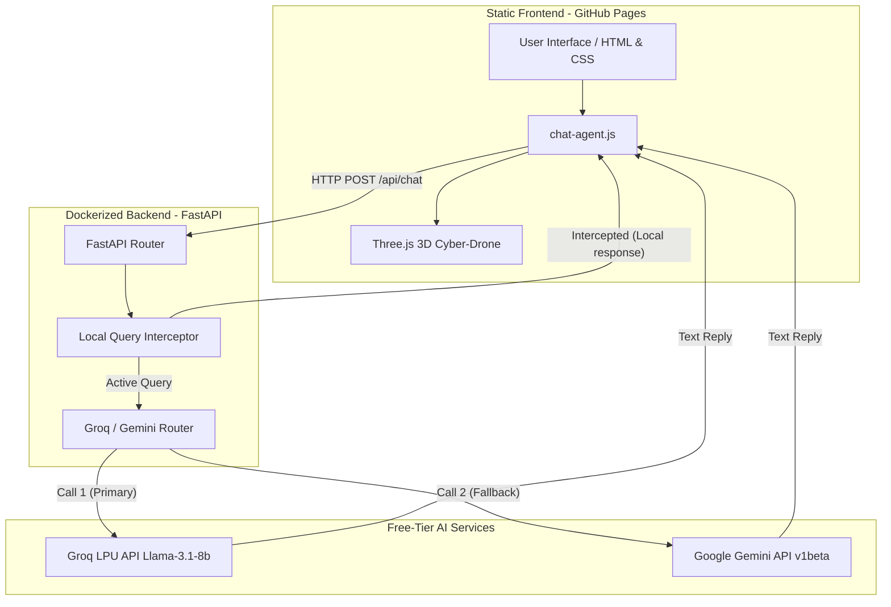
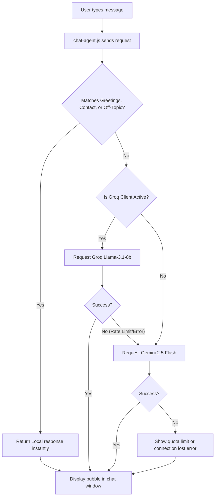

# Naga Hanuma Kanchumati - Professional Portfolio & 3D AI Agent

Welcome to the repository of **Naga Hanuma Kanchumati's** developer portfolio. This project showcases enterprise-grade python/FastAPI backend engineering, API security skills, and interactive Generative AI modules, built entirely on lightweight static files, open-source technologies, and free-tier AI APIs.

---

## 🚀 Key Features

* **3D AI Agent Assistant**: An interactive 3D cyber-drone chatbot model sitting at the bottom right. Users can talk to it, and it will respond using a hybrid, ultra-fast **Groq** backend (using Llama-3.1-8b) with a **Gemini** fallback. It also tracks the user's cursor dynamically.
* **Particle Hero Background**: Uses `Particles.js` to render a modern, interactive constellation grid that responds to mouse hover and click events.
* **Typing Animation**: A subtitle effect on the main hero landing page powered by `Typed.js`.
* **Dark Cyber Aesthetic**: Built using custom dark-mode variables, smooth glassmorphic cards, glowing borders, and modern grid systems.
* **Project Showcase**: A dedicated catalog listing enterprise-level backend modules.

---

## 🏗️ System Architecture

This portfolio leverages a decoupled, serverless-ready architecture. The frontend resides statically on GitHub Pages for optimal load performance, while the lightweight FastAPI backend is packaged inside a secure, non-root Linux Docker container.

---

## 🔄 Chatbot Process Flow

To minimize latency and maximize free-tier API daily limits, a **Local Query Interceptor** scans queries to resolve simple questions locally before routing to the LLM APIs. If an API call is required, the router implements a **Groq-first, Gemini-fallback** failover hierarchy.

---

## ⚡ Hybrid API Integration (Groq & Gemini)

To provide an intelligent virtual assistant completely free of hosting fees, the backend implements:

### 1. Groq LPU API (Primary Engine)
* **Model**: `llama-3.1-8b-instant` / `llama-3.3-70b-versatile`
* **Performance**: Ultra-low latency (over 500 tokens/sec).
* **Role**: Handles standard conversational interactions. It is checked first because of its high free-tier rate limits (up to 14,400 requests per day).

### 2. Google Gemini API (Failsafe Fallback)
* **Model**: `gemini-2.5-flash` / `gemini-2.0-flash`
* **Role**: If Groq hits a daily limit or fails to respond, the backend automatically fails over to the Gemini API, maintaining 100% chatbot uptime.

### 3. Local Interceptor (Quota Protector)
* Automatically answers basic greetings (*"hi"*, *"hello"*), casual prompts (*"who are you"*), and specific requests for Naga's email, phone, or resume without calling any external APIs.

---

## 🛠️ Technology Stack (Frontend)

* **Markup**: HTML5 (Semantic Structure)
* **Styling**: Vanilla CSS3 (Custom Variables, Hover Micro-animations, Glassmorphism, Responsive Media Queries)
* **Libraries (via CDN)**:
  * **Three.js** (WebGL 3D Rendering)
  * **GLTFLoader.js** (For loading 3D assets)
  * **Particles.js** (Hero interactive constellation background)
  * **Typed.js** (Interactive typing headings)
  * **Bootstrap v4 / Boxicons / Icofont** (Responsive grid systems and modern iconography)

---

